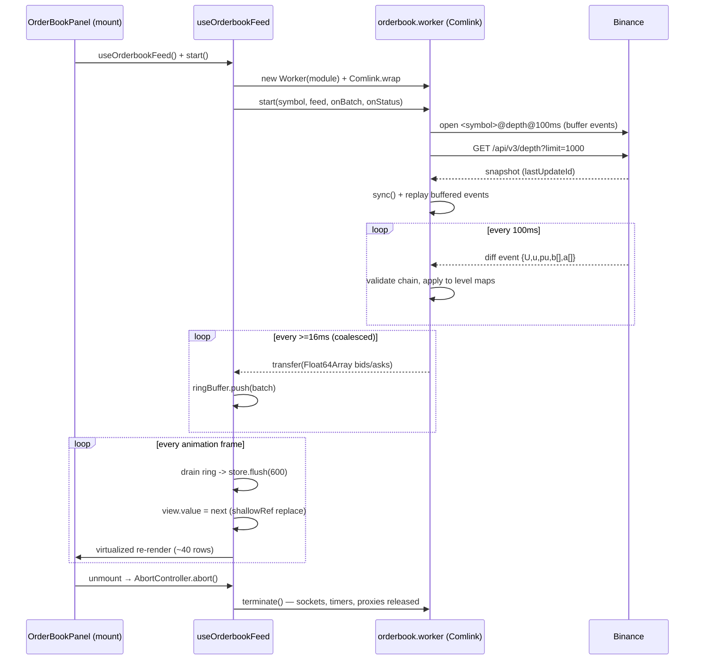

# Order Book Render Engine

A high-frequency order book UI for Nuxt 4 / Vue 3 that stays at 60fps while
consuming a continuous diff stream (Binance `@depth@100ms`), built around a
Web Worker data plane, a non-reactive ring-buffer store, and a
`requestAnimationFrame`-driven render loop.

**Verification gates (all blocking in CI):** lint, typecheck, unit tests,
E2E functional tests, and performance tests proving **INP < 200ms** and
**zero main-thread tasks >= 50ms** under a 100 events/s load, plus a nightly
**30-minute soak** with heap-leak assertions.

---

## 1. Data flow: WebSocket → Web Worker → Virtual DOM

```mermaid
flowchart LR
    subgraph Data Plane["Data plane (off main thread)"]
        WS["Binance WebSocket<br/><code>btcusdt@depth@100ms</code>"] --> RAW["Raw message handler<br/>(JSON.parse in worker)"]
        RAW --> DIFF["DepthDiffEngine<br/>sequence validation + level maps"]
        REST["REST snapshot<br/>/api/v3/depth?limit=1000"] --> DIFF
        DIFF --> COALESCE["Batch coalescer<br/>(≥16ms interval)"]
        COALESCE --> XFER["Float64Array batches<br/>zero-copy transfer"]
    end

    subgraph Main Thread["Main thread"]
        XFER -->|"Comlink proxy"| RING["RingBuffer (512 slots)<br/>aggregation + back-pressure"]
        RING -->|"drain() once per frame"| STORE["OrderBookStore<br/>pure TypeScript class"]
        STORE -->|"flush(600) sorted view"| RAF["requestAnimationFrame loop"]
        RAF --> SHALLOW["shallowRef(view)<br/>replaced, never mutated"]
        SHALLOW --> VLIST["VirtualList<br/>(windowed, fixed row height)"]
        VLIST --> DOM["Virtual DOM / DOM<br/>~40 rows in DOM for 1200 levels"]
    end

    PINIA["Pinia<br/>UI / session only"] -.->|"1Hz stats, controls"| RAF
```





## 2. Design decisions

| Concern | Decision | Why |
| --- | --- | --- |
| Parsing & diffing | Inside the Web Worker | Raw payloads, `JSON.parse` and sequence validation never touch the main thread. The main thread only receives coalesced `Float64Array` batches (zero-copy transfer). |
| IPC | [Comlink](https://github.com/GoogleChrome/comlink) | Type-safe RPC over `postMessage`; callbacks proxied, buffers transferred. |
| Data state | Pure TypeScript class `OrderBookStore` + `RingBuffer` — **not** reactive | Running thousands of mutations/s through Vue/Pinia reactivity would invalidate the dependency graph every tick. The book is opaque to the framework; the render loop reads it imperatively. |
| Back-pressure | 512-slot ring buffer (newest-wins overwrite) | If the feed outpaces the monitor, excess batches coalesce into level maps per frame; drops are counted and surfaced in the UI stats. |
| Render sync | `requestAnimationFrame` | Buffer reads are locked to the display refresh rate; between flushes returning the shared empty view skips the `shallowRef` write entirely, so the vdom idles. |
| UI state | Pinia (`session` store) only | Connection status, symbol/feed selection, pause flag, and a 1Hz stats mirror change at human speed — reactivity there is free. |
| Large lists | Custom windowed `VirtualList` | Fixed row height + passive scroll → constant DOM (~40 rows for 500+ levels), `contain: strict` isolation. |
| Change signal | `shallowRef` + replace | The view object is swapped, never mutated; downstream components re-render once per frame at most, and no deep reactivity wraps the row arrays. |
| Lifecycle | `AbortController` per feed | Abort on scope dispose → cancel rAF, clear interval, terminate worker, drain ring buffer. No orphaned workers, listeners, or detached DOM nodes after unmount. |
| CI determinism | Synthetic feed (Binance-protocol-compatible) | E2E/perf/soak run against a deterministic 100 events/s generator (valid `U/u/pu` chains) so gates don't depend on exchange reachability; live feed is one selector away. |

## 3. Binance diff protocol handling (`app/lib/orderbook/depth-diff.ts`)

1. Open `<symbol>@depth@100ms`, buffer events.
2. Fetch REST snapshot (`limit=1000`), drop buffered events with `u <= lastUpdateId`.
3. First applied event must bridge `lastUpdateId + 1` (`U <= lastUpdateId+1 <= u`); its `pu` is not validated per spec.
4. Every later event must satisfy `pu === previous u`.
5. On any violation: reset + resync (fresh WS + snapshot), counted in the UI stats.

## 4. Performance budgets (blocking, `tests/e2e/performance.spec.ts`)

| Metric | Budget | Measured with |
| --- | --- | --- |
| INP (worst interaction) | < 200 ms | Event Timing API, `durationThreshold: 16`, worst entry during an 8s interaction burst against a 100 events/s feed |
| Main-thread task | no task >= 50 ms | `PerformanceObserver('longtask')` over the same window |
| DOM size | < 100 rows in DOM | virtualization check in `tests/e2e/orderbook.spec.ts` |

## 5. Soak test (memory leak verification)

- **Browser** (`tests/e2e/soak.spec.ts`, nightly workflow): 30 minutes at 100 events/s, heap + DOM sampled every 15s via `performance.memory`; fails on monotonic growth (median of first vs last third > 1.5x), heap > 350MB, or DOM inflation.
- **Engine** (`tests/unit/soak.test.ts`): the same 30 minutes replayed in Node against `DepthDiffEngine` + `RingBuffer` + `OrderBookStore`, asserting level maps and buffers stay bounded.
- Unmount cleanup is asserted functionally: every E2E navigation abandons the page; worker termination is wired through `AbortController` in `useOrderbookFeed.dispose()`.

```bash
npm run test:soak            # browser heap soak (SOAK_DURATION_MS=1800000)
RUN_SOAK=1 npm run test:soak:unit
```

## 6. Project layout

```
app/
  workers/           # data plane
    orderbook.worker.ts   # Comlink-exposed worker: WS, REST sync, diff, coalescing
    feed/synthetic.ts     # deterministic Binance-protocol-compatible feed
    protocol.ts           # shared worker contract types
  lib/
    ring-buffer.ts        # power-of-two ring buffer (aggregation boundary)
    orderbook/depth-diff.ts  # pure Binance diff engine (unit-tested in Node)
    orderbook/store.ts    # pure order book store: flush -> sorted windowed view
  composables/
    useOrderbookFeed.ts   # worker lifecycle + rAF render loop + abort cleanup
  components/
    VirtualList.vue       # windowed list (fixed row height, contain: strict)
    DepthRow.vue          # depth bar + flash animation
    OrderBookPanel.vue    # asks/mid/bids layout, controls
  stores/
    session.ts            # Pinia: UI/session state ONLY (1Hz stats mirror)
tests/
  unit/                  # ring buffer, diff protocol, store, engine soak
  e2e/                   # functional, performance (INP/longtask), memory soak
.github/workflows/       # ci.yml (4 blocking gates), soak.yml (nightly)
```

## 7. Stability evidence (profiler benchmarks)

Capture evidence after running the soak locally and attach screenshots to
`docs/screenshots/` — the README reviewers expect proof, not promises:

```bash
# 1. start a 100 events/s feed and profile it
npm run build && npm run preview &
npx playwright test --project=soak   # or open http://localhost:4173/?feed=synthetic&rate=100

# 2. Chrome DevTools → Memory tab → Heap snapshot at t=0 and t=30min
#    compare retained size of: OrderBookStore maps, RingBuffer slots, Worker
# 3. Performance tab → record 30s during the burst:
#    screenshot the main-thread flame chart (all tasks < 50ms)
# 4. save as docs/screenshots/{heap-t0.png,heap-t30m.png,flamechart.png}
```

| Evidence | Expected result |
| --- | --- |
| `docs/screenshots/heap-t0.png` vs `heap-t30m.png` | flat JS heap; no growing `Map` / retained batches |
| `docs/screenshots/flamechart.png` | continuous rAF ticks, no task crossing the 50ms line |
| Soak workflow artifacts | `soak-timeline.json` with heap/DOM samples across 30 minutes |

## 8. Commands

```bash
npm run dev        # dev server (default: synthetic feed)
npm run lint       # ESLint (blocking)
npm run typecheck  # vue-tsc via nuxt typecheck (blocking)
npm run test:unit  # Vitest (blocking)
npm run test:e2e   # Playwright functional + performance gates (blocking)
npm run ci         # all blocking gates locally
```
