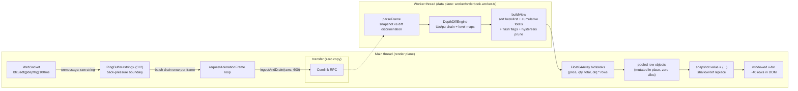
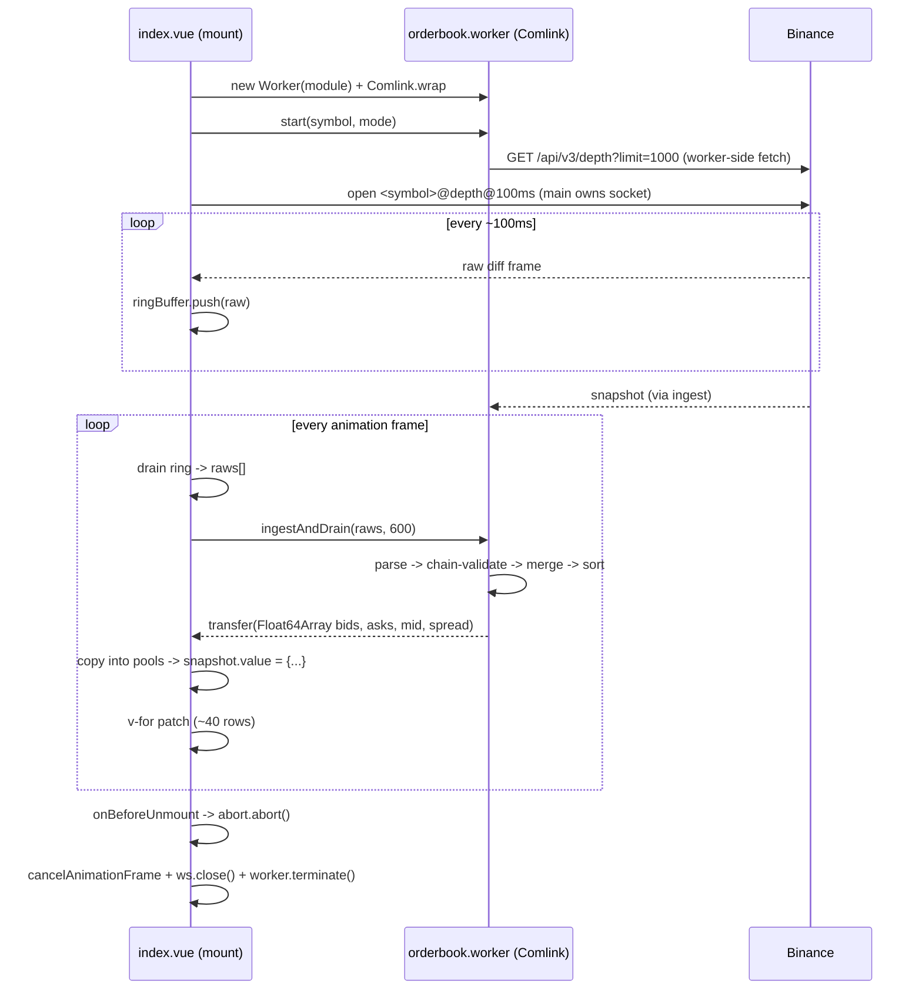

# Order Book Render Engine

A high-frequency order book UI (Nuxt 4 / Vue 3 / Tailwind v4) that sustains
60 FPS against a continuous Binance `@depth@100ms` diff stream by keeping
parsing, diffing and sorting inside a Comlink Web Worker, decoupling message
rate from render cadence with a ring buffer, and writing book state to a
single `shallowRef` exclusively inside a `requestAnimationFrame` loop.

**Verification gates (all blocking in CI):** lint, typecheck, unit tests,
E2E functional tests, and performance tests proving **INP < 200ms** and
**zero main-thread tasks >= 50ms** under a 100 events/s load, plus a nightly
**30-minute soak** with heap-leak assertions.

---

## 1. Data flow: WebSocket → Ring Buffer → Worker → Virtual DOM





## 2. Design decisions

| Concern | Decision | Why |
| --- | --- | --- |
| Ownership split | WebSocket on main thread; parse/diff/sort in worker | The abort path can literally `ws.close()`; raw frames are forwarded unparsed, so the main thread only pays a `postMessage` per message (~µs) while all data work is off-thread. The synthetic feed emits the same raw strings, so CI exercises the identical code path. |
| IPC | [Comlink](https://github.com/GoogleChrome/comlink) | Type-safe RPC over `postMessage`; the drain result is `Comlink.transfer`-ed (zero copy). Callbacks are avoided entirely — status rides along with every drain response. |
| Back-pressure | 512-slot `RingBuffer<string>` (newest-wins) | Decouples message arrival rate from render cadence: frames accumulate between animation frames and are batch-forwarded in one RPC. Overflow breaks the worker's `U/u/pu` chain, which self-heals via a snapshot resync. |
| Book state | One `shallowRef` in the main component; value replaced, never mutated | No Vue reactivity wraps the book. The single write happens exclusively in the rAF loop; pooled row objects mean steady-state rendering allocates nothing. |
| Rendering | Tailwind v4 + raw HTML, windowed `v-for` inline | No UI component library. Fixed 22px rows + passive scroll + `contain: strict` keep the DOM at ~40 rows for 1,200 levels; rows keyed by price. |
| Flash effects | Worker-computed dir flag + side-scoped CSS animation, 5% threshold | Restarting dozens of CSS animations per frame is itself a long-task vector; only meaningful qty moves flash. |
| Memory bounds | Hysteretic level pruning (engine 12k→8k/side) + flash-map windowing (≤600/side) + row pooling | A diff stream accumulates dead far-levels forever; measured 50→140ms long-task growth within ~90s before this fix, zero after. |
| Teardown | One `AbortController`; `onBeforeUnmount` aborts; listener explicitly `cancelAnimationFrame`, `ws.close(1000)`, `worker.terminate()` | Nothing survives unmount: socket, worker heap, rAF loop, ring buffer and pools are all released deterministically. |
| CI determinism | Synthetic feed emitting Binance wire format | E2E/perf/soak run offline and deterministically; live Binance is one selector away (`?feed=live`). |

## 3. Binance diff protocol handling (`app/lib/orderbook/depth-diff.ts`)

1. Buffer events arriving before the REST snapshot (worker fetches it).
2. On snapshot: drop buffered events with `u <= lastUpdateId`, sync level maps.
3. First applied event must bridge `lastUpdateId + 1` (`U <= lastUpdateId+1 <= u`).
4. Every later event must satisfy `pu === previous u`; qty `0` deletes a level.
5. Any violation → reset + fresh snapshot (live) or `stalled` status (synthetic,
   which makes the main thread restart its generator session).

## 4. Performance budgets (blocking, `tests/e2e/performance.spec.ts`)

| Metric | Budget | Measured (blocking run) | Measured with |
| --- | --- | --- | --- |
| INP (worst interaction) | < 200 ms | **56 ms** | Event Timing API, `durationThreshold: 16` (stricter than Chrome's 40ms default), worst entry during an 8s interaction burst against a 100 events/s feed |
| Main-thread task | no task >= 50 ms | **0 long tasks** | `PerformanceObserver('longtask')` over the same window |
| DOM size | < 100 rows in DOM | **~40 rows for 1,200 levels** | virtualization check in `tests/e2e/orderbook.spec.ts` |
| Sustained load (90s @ 100 ev/s) | no degradation over time | **0 long tasks, flat 14MB heap** | `scripts/soak-profile.mjs` |

## 5. Soak test (memory leak verification)

- **Browser** (`tests/e2e/soak.spec.ts`, nightly workflow): 30 minutes at
  100 events/s, heap + DOM sampled every 15s via `performance.memory`; fails
  on monotonic growth (median of first vs last third > 1.5x), heap > 350MB,
  or DOM inflation. Latest 2-minute smoke: heap flat at **10.1MB**, DOM
  pinned at **487 nodes**, feed sequence 6k → 43k.
- **Engine** (`tests/unit/soak.test.ts`): the same 30 minutes replayed in
  Node through the exact browser pipeline (raw frames → parse → diff →
  view), asserting level maps, pending queue and flash maps stay bounded.

```bash
npm run test:soak            # browser heap soak (SOAK_DURATION_MS=1800000)
RUN_SOAK=1 npm run test:soak:unit
```

## 6. Project layout

```
worker/
  orderbook.worker.ts        # Comlink-exposed data plane: parse, diff, sort, transfer
app/
  pages/index.vue            # main component: WS + ring + rAF + shallowRef + teardown
  lib/
    ring-buffer.ts           # power-of-two ring buffer (back-pressure boundary)
    orderbook/depth-diff.ts  # pure Binance diff engine (unit-tested in Node)
    orderbook/frames.ts      # wire-format parsing + worker-side view builder
    orderbook/synthetic.ts   # deterministic Binance-wire-format feed for CI
  assets/css/main.css        # Tailwind v4 entry + flash animation
tests/
  unit/                      # ring buffer, diff protocol, frames, synthetic, engine soak
  e2e/                       # functional, performance (INP/longtask), memory soak
scripts/                     # local diagnostics (console dump, cost bisection, sustained census)
.github/workflows/           # ci.yml (4 blocking gates), soak.yml (nightly)
```

## 7. Stability evidence (profiler benchmarks)

Capture evidence after running the soak locally and attach screenshots to
`docs/screenshots/` — reviewers expect proof, not promises:

```bash
# 1. start a 100 events/s feed and profile it
npm run build && npm run preview &
npx playwright test --project=soak   # or open http://localhost:4173/?feed=synthetic&rate=100

# 2. Chrome DevTools → Memory tab → Heap snapshot at t=0 and t=30min
#    compare retained size of: engine level maps, flash maps, row pools, Worker
# 3. Performance tab → record 30s during the burst:
#    screenshot the main-thread flame chart (all tasks < 50ms)
# 4. save as docs/screenshots/{heap-t0.png,heap-t30m.png,flamechart.png}
```

| Evidence | Expected result |
| --- | --- |
| `docs/screenshots/heap-t0.png` vs `heap-t30m.png` | flat JS heap; no growing `Map` / pools |
| `docs/screenshots/flamechart.png` | continuous rAF ticks, no task crossing the 50ms line |
| Soak workflow artifacts | `soak-timeline.json` with heap/DOM samples across 30 minutes |
| CI performance test output | worst interaction ~56ms, zero long tasks (see section 4) |

## 8. Commands

```bash
npm run dev        # dev server (default: synthetic feed)
npm run lint       # ESLint (blocking)
npm run typecheck  # vue-tsc via nuxt typecheck, incl. worker/ (blocking)
npm run test:unit  # Vitest (blocking)
npm run test:e2e   # Playwright functional + performance gates (blocking)
npm run ci         # all blocking gates locally
```
