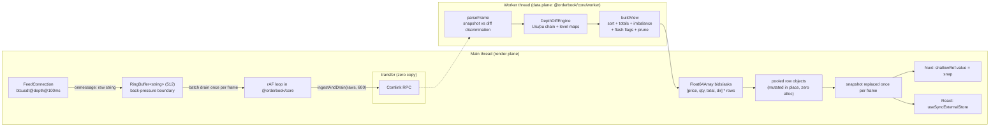

# High-Frequency Orderbook Render Engine

A monorepo (Turborepo + pnpm) showcasing **framework-agnostic performance
engineering**: one TypeScript data-plane core — `@orderbook/core` — sustains
a 60 FPS order book UI against continuous exchange-grade streams
(Binance `@depth@100ms`, synthetic bursts up to 1,000 events/s), and two
independent renderers — **Nuxt 4 (Vue)** and **React 19 (Vite)** — consume
the exact same engine with equivalent performance discipline.

**Verification gates (all blocking in CI):** lint, typecheck, unit tests,
E2E functional tests, and performance tests proving **INP < 200ms** and
**zero main-thread tasks >= 50ms** under a 100 events/s load — enforced for
both the Nuxt *and* React clients — plus a nightly **30-minute soak** with
heap-leak assertions.

---

## 1. Monorepo layout

```
apps/
  landing/                 # static root app (Vite + vanilla TS) — serves /
    └── vercel.json        #   rewrites /react/* and /nuxt/* to the clients
  nuxt-client/             # Nuxt 4 renderer — served under /nuxt
    app/pages/index.vue    #   shallowRef boundary + windowed v-for
    worker/                #   1-line worker shim → @orderbook/core/worker
    tests/e2e/             #   functional, performance (INP/longtask), soak
  react-client/            # React 19 + Vite renderer — served under /react
    src/useOrderbook.ts    #   useSyncExternalStore at rAF cadence
    worker/                #   1-line worker shim → @orderbook/core/worker
    tests/e2e/             #   the same functional + performance gates
packages/
  core/                    # @orderbook/core — the framework-agnostic engine
    src/
      client.ts            # OrderbookClient: worker + ring + rAF orchestrator
      feed-connection.ts   # WebSocket / synthetic transport management
      ring-buffer.ts       # power-of-two ring buffer (back-pressure boundary)
      orderbook/depth-diff.ts   # pure Binance U/u/pu diff protocol engine
      orderbook/frames.ts       # wire parsing + worker view builder
      orderbook/imbalance.ts    # order-book imbalance metrics
      orderbook/synthetic.ts    # deterministic Binance-wire feed for CI
      worker/orderbook.worker.ts# Comlink data plane (transferable views)
      types.ts             # strict shared types (no Vue, no React)
    tests/                 # unit tests (run in Node, no browser needed)
  eslint-config/           # shared ESLint flat config (typescript-eslint)
docs/screenshots/          # profiler evidence for reviewers
.github/workflows/         # ci.yml (4 blocking gates), soak.yml (nightly)
```

### The core contract

`@orderbook/core` has **zero framework dependencies** (only `comlink`). It
ships raw TypeScript source (the "internal package" pattern) and exports:

| Export | Purpose |
| --- | --- |
| `OrderbookClient` | owns the worker, ring buffer, rAF drain loop, row pools; replaces a cached snapshot at most once per animation frame |
| `FeedConnection` | live Binance WS management (reconnect, raw passthrough) or synthetic transport |
| `DepthDiffEngine` | pure diff-depth protocol engine (buffer → sync → chain-validate → merge → hysteresis prune) |
| `parseFrame` / `buildView` | wire-format parsing + worker-side view builder with imbalance |
| `RingBuffer` | 512-slot newest-wins back-pressure boundary |
| `SyntheticFeed` | deterministic Binance-wire-format generator (CI runs the identical code path as live) |
| `@orderbook/core/worker` | side-effect entry: `Comlink.expose(new OrderBookWorker())` |

Each app contributes only a one-line bundler shim so its bundler can
resolve the worker URL:

```ts
// apps/*/worker/orderbook.worker.ts
import '@orderbook/core/worker'
```

## 2. Data flow: WebSocket → Ring Buffer → Worker → DOM


```mermaid
flowchart LR
    subgraph MainThread["Main thread (render plane)"]
        WS["FeedConnection<br/>btcusdt@depth@100ms"] -->|"onmessage: raw string"| RING["RingBuffer&lt;string&gt; (512)<br/>back-pressure boundary"]
        RING -->|"batch drain once per frame"| RAF["rAF loop in @orderbook/core"]
        RAF -->|"ingestAndDrain(raws, 600)"| RPC
        subgraph Transfer["transfer (zero copy)"]
            RPC["Comlink RPC"]
        end
        TRANS["Float64Array bids/asks<br/>[price, qty, total, dir] * rows"] --> POOL["pooled row objects<br/>(mutated in place, zero alloc)"]
        POOL --> SNAP["snapshot replaced once per frame"]
        SNAP --> VUE["Nuxt: shallowRef.value = snap"]
        SNAP --> REACT["React: useSyncExternalStore"]
    end

    subgraph WorkerThread["Worker thread (data plane: @orderbook/core/worker)"]
        PARSE["parseFrame<br/>snapshot vs diff discrimination"] --> DIFF["DepthDiffEngine<br/>U/u/pu chain + level maps"]
        DIFF --> SORT["buildView<br/>sort + totals + imbalance<br/>+ flash flags + prune"]
        SORT --> TRANS
    end

    RPC -.-> PARSE
```

Both UI frameworks receive the same per-frame contract — a cached snapshot
object whose identity changes at most once per animation frame, containing
pooled row arrays that are mutated in place (zero steady-state allocation):

- **Nuxt** writes it into a single `shallowRef` (value replaced, never
  mutated — no Vue reactivity ever wraps the book).
- **React** reads it through `useSyncExternalStore`, which re-renders at
  display cadence, never at message cadence.

## 3. Design decisions

| Concern | Decision | Why |
| --- | --- | --- |
| Ownership split | WebSocket transport on main thread; parse/diff/sort in worker | The abort path can literally `ws.close()`; raw frames are forwarded unparsed, so the main thread only pays a `postMessage` per message (~µs) while all data work is off-thread. The synthetic feed emits the same raw strings, so CI exercises the identical code path. |
| IPC | [Comlink](https://github.com/GoogleChrome/comlink) | Type-safe RPC over `postMessage`; the drain result is `Comlink.transfer`-ed (zero copy). Callbacks are avoided entirely — status rides along with every drain response. |
| Back-pressure | 512-slot `RingBuffer<string>` (newest-wins) | Decouples message arrival rate from render cadence: frames accumulate between animation frames and are batch-forwarded in one RPC. Overflow breaks the worker's `U/u/pu` chain, which self-heals via a snapshot resync. |
| Reactivity | One cached snapshot per frame; Vue `shallowRef` replace / React `useSyncExternalStore` | No framework reactivity wraps the book. The single write happens exclusively in the rAF loop; pooled row objects mean steady-state rendering allocates nothing. |
| Rendering | Tailwind v4 + raw HTML, windowed lists inline | No UI component library. Fixed 22px rows + passive scroll + `contain: strict` keep the DOM at ~40 rows for 1,200 levels; rows keyed by price. |
| Flash effects | Worker-computed dir flag + side-scoped CSS animation, 5% threshold | Restarting dozens of CSS animations per frame is itself a long-task vector; only meaningful qty moves flash. |
| Memory bounds | Hysteretic level pruning (engine 12k→8k/side) + flash-map windowing (≤600/side) + row pooling | A diff stream accumulates dead far-levels forever; measured 50→140ms long-task growth within ~90s before this fix, zero after. |
| Imbalance | Worker-computed from window cumulative totals | Bid/ask pressure is a data-plane metric (`bidVol / (bidVol+askVol)`); both UIs render the same gauge without touching level maps. |
| Teardown | `OrderbookClient.stop()` is deterministic and re-entrant | Nothing survives unmount: socket, worker heap, rAF loop, ring buffer and pools are all released; StrictMode's start→stop→start cycle is safe. |
| CI determinism | Synthetic feed emitting Binance wire format | E2E/perf/soak run offline and deterministically; live Binance is one selector away (`?feed=live`). |

## 4. Binance diff protocol handling (`packages/core/src/orderbook/depth-diff.ts`)

1. Buffer events arriving before the REST snapshot (worker fetches it).
2. On snapshot: drop buffered events with `u <= lastUpdateId`, sync level maps.
3. First applied event must bridge `lastUpdateId + 1` (`U <= lastUpdateId+1 <= u`).
4. Every later event must satisfy `pu === previous u`; qty `0` deletes a level.
5. Any violation → reset + fresh snapshot (live) or `stalled` status (synthetic,
   which makes the client restart its generator session).

## 5. Performance budgets (blocking, enforced per client)

| Metric | Budget | Measured (Nuxt) | Measured with |
| --- | --- | --- | --- |
| INP (worst interaction) | < 200 ms | **56 ms** | Event Timing API, `durationThreshold: 16` (stricter than Chrome's 40ms default), worst entry during an 8s interaction burst against a 100 events/s feed |
| Main-thread task | no task >= 50 ms | **0 long tasks** | `PerformanceObserver('longtask')` over the same window |
| DOM size | < 100 rows in DOM | **~40 rows for 1,200 levels** | virtualization check in both e2e suites |
| Sustained load (90s @ 100 ev/s) | no degradation over time | **0 long tasks, flat 14MB heap** | `scripts/soak-profile.mjs` |

The React client runs the identical gates (`apps/react-client/tests/e2e/`),
proving the core keeps both frameworks inside the same envelope.

## 6. Soak test (memory leak verification)

- **Browser** (`apps/nuxt-client/tests/e2e/soak.spec.ts`, nightly workflow):
  30 minutes at 100 events/s, heap + DOM sampled every 15s via
  `performance.memory`; fails on monotonic growth, heap > 350MB, or DOM
  inflation.
- **Engine** (`packages/core/tests/soak.test.ts`): the same 30 minutes
  replayed in Node through the exact browser pipeline (raw frames → parse →
  diff → view), asserting level maps, pending queue and flash maps stay
  bounded.

```bash
pnpm run test:soak            # browser heap soak (SOAK_DURATION_MS=1800000)
pnpm run test:soak:unit       # engine soak in Node
```

## 7. Running locally

Requires Node >= 22 and pnpm >= 10 (`corepack enable` picks up the version
from `packageManager`).

```bash
pnpm install

# everything at once (landing :5173, react :5174, nuxt :3001)
pnpm run dev

# or one at a time
pnpm run dev:landing        # http://localhost:5173  (CTAs auto-target local ports)
pnpm run dev:react          # http://localhost:5174/react/
pnpm run dev:nuxt           # http://localhost:3001/nuxt/

# verification gates
pnpm run lint               # ESLint across every package
pnpm run typecheck          # tsc / vue-tsc across every package
pnpm run test:unit          # Vitest (core engine, protocol, imbalance, soak-model)
pnpm run test:e2e           # Playwright functional + performance gates (both clients)
pnpm run ci                 # all blocking gates locally
```

Both clients boot the deterministic synthetic feed by default; append
`?feed=live` for Binance or `?rate=1000` to stress the pipeline.

## 8. Deployment (Vercel)

The workspace deploys as **three Vercel projects from this one repository**,
each with its **Root Directory** set (Vercel detects pnpm workspaces and
installs the full graph automatically):

| Path served | Project | Root Directory | Build output |
| --- | --- | --- | --- |
| `/` | landing | `apps/landing` | static (Vite) |
| `/react/*` | react-client | `apps/react-client` | static (Vite, `base: '/react/'`) |
| `/nuxt/*` | nuxt-client | `apps/nuxt-client` | Nitro (Nuxt, `baseURL: '/nuxt/'`) |

Routing is centralized in `apps/landing/vercel.json`: the landing project
rewrites `/react/*` and `/nuxt/*` to the two client deployments, so one
domain serves everything:

```
GET /              → apps/landing (static)
GET /react/*       → rewrite → react-client project  (base /react/)
GET /nuxt/*        → rewrite → nuxt-client project   (base /nuxt/)
```

Setup:

1. Create the three projects (Import Git repository, select the Root
   Directory from the table above; Framework Preset auto-detects Vite/Nuxt).
2. Copy each client's production domain (e.g.
   `https://orderbook-react.vercel.app`), then in the **landing** project
   set the environment variables referenced by its rewrite config:
   - `REACT_CLIENT_URL` — production domain of the react-client project
   - `NUXT_CLIENT_URL` — production domain of the nuxt-client project
3. Redeploy the landing project so the rewrites pick up the variables.

No path-prefixed asset config is needed beyond what is committed: both
clients already build with their base paths (`vite base`, Nuxt `app.baseURL`),
so the rewrite targets serve canonical, correctly-asset-linked apps.

## 9. Stability evidence (profiler benchmarks)

Capture evidence after running the soak locally and attach screenshots to
`docs/screenshots/` — reviewers expect proof, not promises:

```bash
# 1. start a 100 events/s feed and profile it
pnpm run dev:nuxt &
npx playwright test --project=soak   # or open http://localhost:3001/nuxt/?feed=synthetic&rate=100

# 2. Chrome DevTools → Memory tab → heap snapshot at t=0 and t=30min
# 3. Performance tab → record 30s; screenshot the main-thread flame chart
# 4. save as docs/screenshots/{heap-t0.png,heap-t30m.png,flamechart.png}
```

| Evidence | Expected result |
| --- | --- |
| `docs/screenshots/heap-t0.png` vs `heap-t30m.png` | flat JS heap; no growing `Map` / pools |
| `docs/screenshots/flamechart.png` | continuous rAF ticks, no task crossing the 50ms line |
| Soak workflow artifacts | `soak-timeline.json` with heap/DOM samples across 30 minutes |
| CI performance test output | worst interaction ~56ms, zero long tasks (both clients) |
